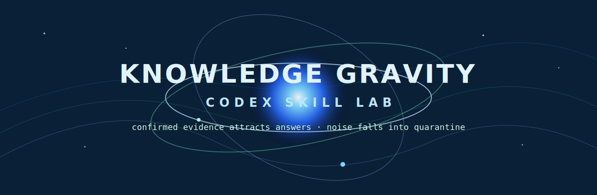

<p align="center">
  
</p>

<h1 align="center">Knowledge Gravity Lab</h1>

<p align="center">
  <strong>A Codex skill for turning messy notes into a practical knowledge map.</strong><br/>
  Find center topics, orphan notes, noisy files, overgrown clusters, and concrete cleanup actions.
</p>

<p align="center">
  
  
  
  
</p>

---

Knowledge Gravity Lab is a shareable Codex skill for knowledge hygiene. Point it
at a folder of Markdown or text notes and it generates a local map of how your
knowledge base is shaped: what pulls attention, what floats alone, what looks
noisy, and what should be cleaned next.

It is built for:

- Obsidian vaults;
- research notes;
- invention logs;
- paper cards;
- memory exports;
- worldbuilding or writing notebooks;
- any messy Markdown folder that needs structure.

## What It Produces

Running the bundled analyzer creates:

| Output | Purpose |
|---|---|
| `knowledge_gravity_report.md` | human-readable summary of centers, clusters, noise, and orphans |
| `knowledge_gravity_action_sheet.md` | temporary cleanup workspace with concrete next actions |
| `knowledge_gravity_nodes.csv` | note-level metrics |
| `knowledge_gravity_edges.csv` | inferred note-to-note links |
| `knowledge_gravity_data.json` | machine-readable analysis payload |

## Why It Feels Different

Most note tools show a graph. This skill asks a more useful question:

> Which notes are pulling the whole knowledge field, and which ones are just drifting?

It scores practical signals such as links, tags, headings, note size, repository
share, center score, orphan status, and review risk. The point is not to produce
a perfect graph. The point is to make the next cleanup action obvious.

## Install

Clone or download this repository, then copy it into your Codex skills folder:

```powershell
git clone https://github.com/JorrrrrdDin/knowledge-gravity-lab.git
Copy-Item -Recurse .\knowledge-gravity-lab "$env:USERPROFILE\.codex\skills\knowledge-gravity-lab"
```

The installed folder should look like this:

```text
knowledge-gravity-lab/
  SKILL.md
  agents/openai.yaml
  scripts/analyze_corpus.py
  references/public-boundary.md
  references/existing-rights-check.md
```

## Use

Ask Codex something like:

```text
Use Knowledge Gravity Lab on my Obsidian vault and tell me what to clean first.
```

Or run the analyzer directly:

```powershell
python scripts\analyze_corpus.py --input "C:\path\to\vault" --output "D:\knowledge-gravity-output"
```

Skip low-value folders when needed:

```powershell
python scripts\analyze_corpus.py --input "C:\path\to\vault" --output "D:\knowledge-gravity-output" --skip-dir "archive" --skip-dir "templates"
```

## Example Feedback Loop

The action sheet is designed to push note cleanup instead of just admiring a
score:

```text
This note is at 61/100.
Add 2 links, split the overgrown section, and connect it to the nearest cluster
to push it toward 80/100.
```

That makes the workflow simple:

1. Run the map.
2. Open the action sheet.
3. Fix the highest-leverage notes.
4. Run again.
5. Watch the knowledge field become cleaner.

## Public Boundary

This is a practical knowledge-hygiene workflow. It is not legal advice, not a
patent filing package, and not a guarantee that a note is true or false.

The skill uses heuristic analysis to help humans review their own knowledge
base. Treat its outputs as decision support, not ground truth.

## Repository Contents

```text
.
├── SKILL.md
├── agents/
│   └── openai.yaml
├── scripts/
│   └── analyze_corpus.py
├── references/
│   ├── public-boundary.md
│   └── existing-rights-check.md
└── assets/
    └── knowledge-gravity-banner.svg
```

## License

MIT License.
